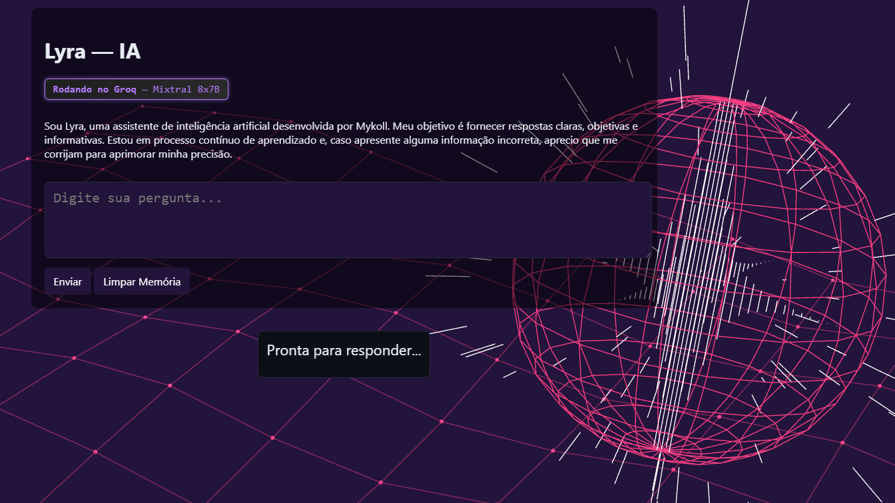

# 🤖 Lyra — Assistente de Inteligência Artificial Personalizada

A **Lyra** é uma assistente de inteligência artificial desenvolvida por **Mykoll**, criada para oferecer respostas **rápidas, claras e objetivas**.  
Com **backend em Node.js**, **frontend responsivo** e **identidade própria**, a Lyra **aprende com cada interação**, graças a um sistema de memória que permite conversas mais naturais e personalizadas com o tempo.


---

## 🚀 Funcionalidades

- **Streaming de respostas em tempo real** para maior fluidez
- **Memória de conversas** para aprendizado e adaptação contínua
- **Frontend responsivo** em HTML, CSS e JavaScript
- **Identidade e personalidade exclusivas**
- Integração com **Groq API** (*Mixtral 8x7B*) para alta velocidade e qualidade nas respostas
- Configuração simples via `.env`

---

## 🛠️ Tecnologias utilizadas

**Backend**
- Node.js
- Express
- Integração com Groq API (compatível com OpenAI API)

**Frontend**
- HTML5, CSS3 e JavaScript
- Suporte a *streaming* de respostas
- Interface de chat intuitiva

---

## 📦 Instalação e uso

### 1. Clone o repositório
```bash
git clone https://github.com/mykoll007/Lyra-IA.git
cd lyra-ia
```

### 2. Instale as dependências
```bash
npm install
```

### 3. Configure as variáveis de ambiente
Crie um arquivo `.env` na raiz do projeto e adicione:
```env
GROQ_API_KEY=sua_chave_aqui
GROQ_MODEL=llama-3.3-70b-versatile
```
> 🔑 A chave da Groq pode ser obtida gratuitamente em: [https://console.groq.com](https://console.groq.com)

### 4. Execute o servidor
```bash
node index.mjs
```

### 5. Acesse no navegador
```
http://localhost:3000
```

---

## 📄 Licença
Este projeto foi desenvolvido por **Mykoll** e está disponível para uso e estudo.  
O modelo de linguagem utilizado é fornecido pela [Groq](https://groq.com) e está sujeito aos termos de uso da plataforma.

---

## 📬 Contato
💼 [LinkedIn](https://linkedin.com/in/mykolldaniel)  
📧 mykoll.daniel@gmail.com

